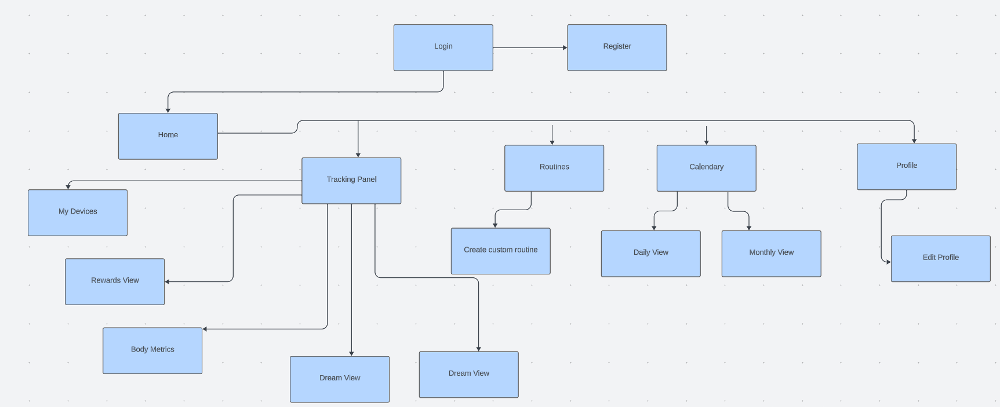

# Proyecto PowerPulse UXD

User experience study for power pulse a fitness progress tracking app.

## Index

- [1. Introduction](#1-introduction)
- [2. Team](#2-Team)
- [3. Strategy](#3-strategy)
- [4. Scope](#4-scope)
  - [4.1 UX Person](#41-ux-person)
  - [4.2 Benchmark](#42-benchmark)
  - [4.3 Customer Journey Map](#43-customer-journey-map)
- [5. Structure](#5-structure)
- [6. Skeleton](#6-skeleton)
- [7. Surface](#7-surface)
---

## 1. Introduction

In today's world, maintaining a healthy and active lifestyle can be challenging. With the increasing importance people place on their physical well-being, the need for effective tools to monitor and enhance health becomes crucial. It is in this context that our innovative physical progress tracking application, based on User Experience Elements, comes into play.

Our application accompanies you on your journey to improved physical fitness by providing a comprehensive solution. It allows you to set goals, customize your workout routines, track your nutrition, record your exercise sessions, and more.

---

## 2. Team

Manuel Espiñeira - Project Manager

Erick Martinez - Designer

Rodrigo Moncada - Designer

Luis Salazar - Designer

---

## 3. Strategy

The initial stage in the Elements of User Experience is the Strategy plane, which emphasizes the importance of considering not only the goals of the application's creators but also the desires of the users themselves.

Following this approach, a Value Proposition Canvas is employed to identify what users seek to gain from our solution and how we plan to address those needs.

---

## 4. Scope

### 4.1. UX Person
This application is designed to empower individuals on their journey to better health and well-being. Whether you are a beginner in the world of fitness or an experienced enthusiast, it offers features that will help you create personalized workout routines, track your macronutrient intake, and maintain a detailed record of your training sessions. Furthermore, it integrates wearable devices that provide valuable insights into your sleep patterns, heart rate, calorie expenditure, and rest intervals. With features like effective routine generation, a rewards system, and a global ranking, this application is your key to efficiently achieving your fitness goals.

---

### 4.2 Benchmark
In the process of developing an application, it is of vital importance to conduct a thorough analysis of the applications already available in the market, especially those that directly compete with ours, in order to ensure that we successfully meet the expectations and requirements of users.

Benchmarking is the key tool that allows us to carry out this activity, helping us identify both areas for improvement and the strengths of these applications. The goal is to effectively integrate these lessons learned into our own product, enabling us to thoroughly understand market expectations and user demands.

---

### 4.3 Customer Journey Map
A Customer Journey Map in the context of an application is essential to comprehensively understand how users interact with the platform throughout their journey, from the initial download to ongoing usage. This allows for the identification of improvement opportunities, customization of the user experience, and ensuring the application meets customer needs and expectations, ultimately contributing to user retention and the long-term success of the application in the market.

---

## 5. Structure

---

## 6. Skeleton
Wireframes
Wireframes help us create simple and schematic visual representations of a user interface, which are used in the design of applications and websites. These drawings or diagrams assist in planning the arrangement of elements on a screen, such as buttons, text, images, and other components, without concerning themselves with visual or graphic details. Wireframes are a fundamental tool for planning and communication in the user interface design process.

Wireframes [here](./files/wireframes/Wireframes%20PowerPulse%20UX-UI.pdf)
---

## 7. Surface
Below, we present the mockups created to address the issue of our project using Figma.

Mockups [here](./files/mockups/Mockups%20PowerPulse%20UX-UI.pdf))
---
