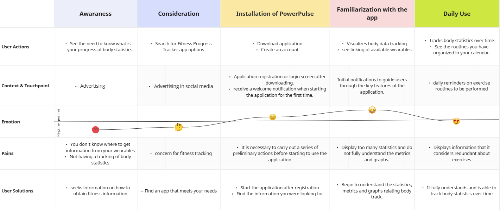

# Proyecto PowerPulse UXD

User experience study for power pulse a fitness progress tracking app.

## Index

- [1. Introduction](#1-introduction)
- [2. Team](#2-Team)
- [3. Strategy](#3-strategy)
- [4. Solutions Scope](#4-solutions-scope)
- [5. Benchmark](#5-Benchmark)
- [6. Customer Journey Map](#6-customer-journey-map)
- [7. Navigation](#7-Navigation)
  - [7.1. Initial Aporach](#71-first-aproach)
  - [7.2. Improved Navigation](#72-improved-navigation)
- [8. Wireframes](#8-wireframes)
- [9. Mockups](#9-mockups)
  - [9.1. Initial Aproach](#91-initial-aproach)
  - [9.2. Improved Mockups](#92-improved-mockups)

---

## 1. Introduction

In today's world, maintaining a healthy and active lifestyle can be challenging. With the increasing importance people place on their physical well-being, the need for effective tools to monitor and enhance health becomes crucial. It is in this context that our innovative physical progress tracking application, based on User Experience Elements, comes into play.

Our application accompanies you on your journey to improved physical fitness by providing a comprehensive solution. It allows you to set goals, customize your workout routines, track your nutrition, record your exercise sessions, and more.

---

## 2. Team

Manuel Espiñeira - Project Manager

Erick Martinez - Designer

Rodrigo Moncada - Designer

Luis Salazar - Designer

---

## 3. Strategy

The initial stage in the Elements of User Experience is the Strategy plane, which emphasizes the importance of considering not only the goals of the application's creators but also the desires of the users themselves.

Following this approach, a Value Proposition Canvas is employed to identify what users seek to gain from our solution and how we plan to address those needs.

---

## 4. Solutions Scope

This application is designed to empower individuals on their journey to better health and well-being. Whether you are a beginner in the world of fitness or an experienced enthusiast, it offers features that will help you create personalized workout routines, track your macronutrient intake, and maintain a detailed record of your training sessions. Furthermore, it integrates wearable devices that provide valuable insights into your sleep patterns, heart rate, calorie expenditure, and rest intervals. With features like effective routine generation, a rewards system, and a global ranking, this application is your key to efficiently achieving your fitness goals.

---

## 5. Benchmark

---

## 6. Customer Journey Map

---

## 7. Navigation

### 7.1. First Aproach

### 7.2. Improved Navigation

---

## 8. Wireframes

---

## 9. Mockups

### 9.1. Initial Aproach

### 9.2. Improved Mockups

---
